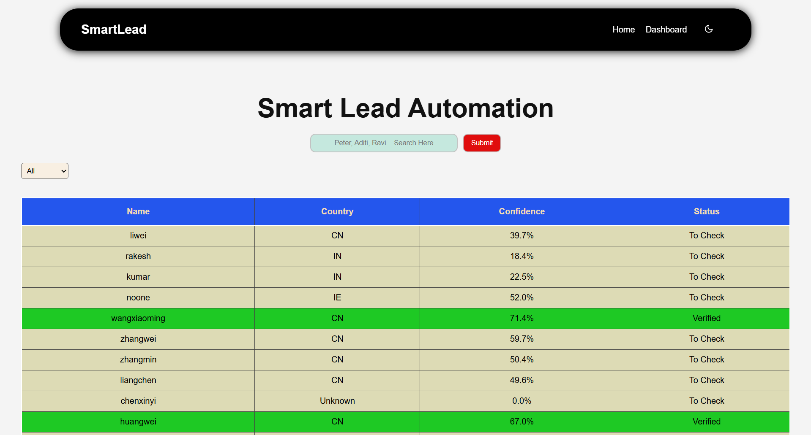
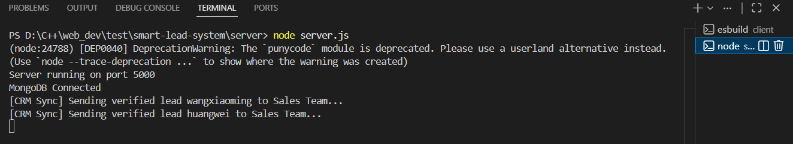

# Smart Lead Automation System  
**VR Automations – Developer Test Assignment**

---

## Project Overview

Smart Lead Automation System is a full-stack MERN application that simulates a real-world lead enrichment and automation workflow.  
The system ingests a batch of names, enriches them using a third-party API, applies business rules, stores the results, and automatically syncs verified leads to a simulated CRM using a background task.

This project focuses on:
- Asynchronous data processing
- External API integration
- Business logic implementation
- Background automation with idempotency
- Clean code with good UI/UX

---

### Landing Page


---

### Dashboard




## Tech Stack

### Frontend
- React (Vite)
- React Router
- Plain CSS

### Backend
- Node.js
- Express.js
- MongoDB (Mongoose)

### Automation
- node-cron

### External API
- Nationalize.io (Nationality prediction)

---

## Project Structure (High Level)

```text
frontend/
├── components/
├── pages/
├── context/
├── styles/
└── App.jsx

backend/
├── controllers/
├── routes/
├── models/
├── services/
├── cron/
└── server.js
```

---

## Setup Instructions

### Clone the Repository
```bash
git clone https://github.com/Ryker009/smart-lead-system.git
cd smart-lead-automation
```

### Backend Setup
cd backend
npm install
node server.js

### Frontend Setup
cd frontend
npm install
npm run dev

---

## Architectural Explanation

### Batch API Request Handling

- The backend receives a batch list of names from the frontend.
- To efficiently process multiple external API calls, the system uses Promise.all to execute all Nationalize.io requests concurrently, rather than sequentially.
- This ensures non-blocking, efficient processing of name batches and prevents performance bottlenecks when handling multiple inputs.

```js
await Promise.all(
  names.map(async (name) => {
    // Call Nationalize API
    // Apply business logic
    // Save result to database
  })
);
```

### Preventing Duplicate Syncs (Idempotency)

A scheduled background task runs every 5 minutes using node-cron.
The system ensures idempotency using a synced flag in the database:

- synced: { type: Boolean, default: false }

To prevent duplicate CRM syncs in the background task, each lead includes a synced boolean flag in the database. The scheduled cron job processes only leads marked as Verified and synced: false.
Once a lead is synced, the flag is updated to true, ensuring idempotency and guaranteeing that the same lead is never processed more than once, even if the job runs multiple times.

### CRM Sync Output



#### Background Task Logic:

- It identifies the leads where: status === "Verified" And synced === false

- It simulate CRM sync by logging like this: [CRM Sync] Sending verified lead {Name} to Sales Team...

- Then, it Marks the lead as synced: true

Finally, this will ensure that :
- Each verified lead is synced only once
- No duplicate processing, even if the cron job runs multiple times

#### Why this approach?

- It prevents sequential API calls
- It avoids blocking the event loop
- This helps in, improving the performance for batch inputs
- It ensures scalability and non-blocking execution

---

### MongoDB Collection (DataBase)


## Live URLs

- **Frontend:** [Smart Lead System](https://smart-lead-system-frontend.onrender.com)
- **Dashboard:** [Dashboard Page](https://smart-lead-system-frontend.onrender.com/dashboard)
- **Backend API:** [API Base URL](https://smart-lead-system-iufq.onrender.com)

## API Endpoints

| Method | Endpoint | Description |
|--------|----------|-------------|
| GET | /api/leads/all | Fetch all processed leads |
| POST | /api/leads/process | Process input names and generate leads |

### Author & Contact

```text
Rakesh Kumar
9646832910
Mail - rakesh9803646587@gmail.com
```